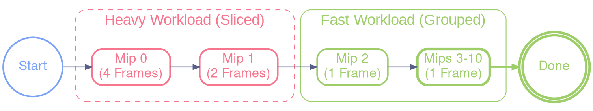

# Progressive & Asynchronous IBL Architecture

This document details the implementation of asynchronous loading and progressive generation of IBL (Image Based Lighting) maps to eliminate freezes when changing environments.

## 1. Overview

The goal was to move from a blocking synchronous load (100ms - 800ms freeze) to a fluid approach where computation time is spread over multiple frames (Time Slicing).

### The Pipeline

1.  **Disk Load (Separate Thread)**: The `.hdr` file is loaded and decoded (stb_image) in a dedicated thread (`async_loader.c`).
2.  **GPU Upload (Main Thread)**: Once ready, raw data is uploaded to VRAM (HDR texture).
3.  **IBL Generation (Progressive)**: A state machine (`app_process_ibl_state_machine`) drives the compute shaders step-by-step to generate:
    *   Irradiance Map (Diffuse).
    *   Specular Prefiltered Map (Reflection).
4.  **Swap (Double Buffering)**: We use "Pending" textures. The old environment remains displayed until the new one is 100% ready.

---

## 2. "Slicing" Strategy

PBR Compute Shaders (especially for high-resolution Specular maps) are very expensive. Computing a full 512x512 texture takes ~250ms on an integrated GPU, freezing the application.

**Solution**: Slice the work horizontally ("Slicing") and only compute one strip of the image per frame.

### 2.1 Overlap Protection (Crucial)

Compute Shader Workgroups have a fixed size (32x32). If we ask to compute a slice **1 pixel** high, the GPU still launches a block 32 pixels high.
Without protection, the 31 excess rows overwrite/recalculate neighboring pixels, massively wasting resources.

**The Fix (`u_max_y_slice`)**:
We pass a precise limit to the shader:
```glsl
// shaders/IBL/spmap.glsl & irmap.glsl
uniform int u_max_y_slice; // Y limit of the current slice

void main_task() {
    // ...
    // Surgical stop to avoid wasted workgroups on slice edges
    if (pixel_pos.y >= u_max_y_slice) return; // Immediate stop for phantom threads
    // ...
}
```

---

## 3. Optimized Configuration (Adaptive Slicing)

To reconcile **fluidity** (no freeze) and **overall speed** (fast loading), we use an adaptive strategy based on the workload weight.

### A. Irradiance Map (64x64)
-   **Strategy**: Constant slicing.
-   **Slicing**: 4 Slices.
-   **Cost**: ~40ms / slice (Total ~160ms).

### B. Specular Map (512x512)
This is the heaviest part. The cost per mipmap decreases exponentially.

| Mip Level | Size | Strategy | Est. Cost / Frame | Description |
| :--- | :--- | :--- | :--- | :--- |
| **Mip 0** | 512x512 | **4 Slices** | ~30-40ms | Heaviest (High Frequency details). |
| **Mip 1** | 256x256 | **2 Slices** | ~20-30ms | Medium. |
| **Mip 2** | 128x128 | **1 Slice** | ~15ms | Light, computed in one go. |
| **Mip 3-10** | 64..1 | **Tail Grouping** | ~20ms (Total) | All computed in **a single frame**. |

**Total "Tail Grouping"**: Grouping small mips (3 to 10) avoids wasting 7 frames of latency for tiny jobs (<1ms each).



---

## 4. Global Performance

With this architecture on an integrated GPU (Intel UHD):
-   **FPS**: Remains fluid (no brutal drop below 30 FPS).
-   **Total Time**: A complete environment transition takes about **600ms to 800ms**.
-   **Perceived Latency**: Near-zero thanks to continuous display of the old environment during computation.

## 5. Key Files

-   `src/app.c`: Contains the State Machine (`app_process_ibl_state_machine`).
-   `src/pbr.c`: Implements sending slicing uniforms (`pbr_prefilter_mip`, `pbr_irradiance_slice_compute`).
-   `shaders/IBL/*.glsl`: Shaders modified to support `u_offset_y` and `u_max_y`.
