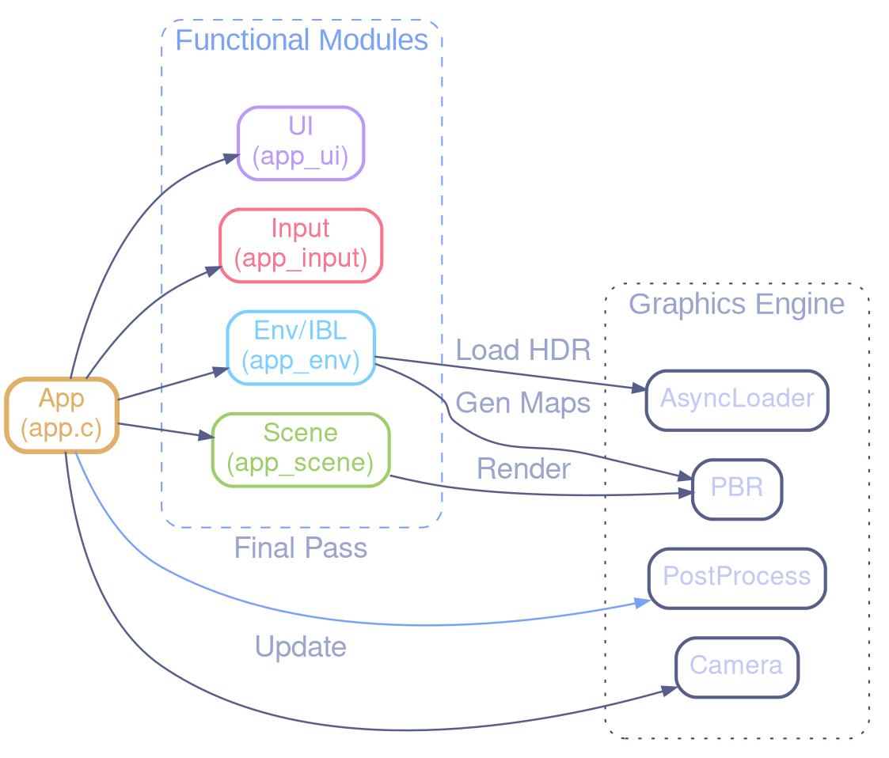

# Project Structure: Refactored Icosphere

## Modular Architecture

The code has been refactored according to the following principles:

- **Separation of Concerns**: Each module has a clear function.
- **Encapsulation**: Data structures are managed by their own modules.
- **Reusability**: Components can be used independently.
- **Maintainability**: Code that is easier to read, test, and modify.

## Folder Structure

```text
icosphere/
├── .github/workflows/  # CI/CD Workflows
│   └── scripts/        # CI-specific scripts (Xvfb wrapper, reporting, ...)
├── src/
│   ├── main.c              # Entry Point
│   ├── app.c               # Orchestration & Loop
│   ├── app_env.c           # IBL Management (Async/Progressive)
│   ├── app_input.c         # Callbacks & Input State
│   ├── app_scene.c         # Scene Rendering (Instanced/Billboards)
│   ├── app_ui.c            # Overlay UI & Debug
│   ├── effects/            # Post-Process Effects (Bloom, DoF, Manual, ...)
│   ├── camera.c            # Camera Physics
│   ├── async_loader.c      # Thread Loading
│   ├── postprocess.c       # FXAA/ToneMapping Pipeline
│   ├── pbr.c               # PBR Functions
│   └── ... (utils, log, shader, texture)
│
├── include/
│   ├── app.h               # Main App Structure
│   ├── app_env.h
│   ├── app_input.h         # AppInputContext seam
│   ├── app_input_state.h   # AppInput sub-struct
│   ├── app_profiling.h     # AppProfiling sub-struct
│   ├── app_scene.h
│   ├── app_ui.h
│   ├── app_window.h        # AppWindow sub-struct
│   ├── gamepad_context.h   # GamepadContext seam
│   ├── scene.h             # Scene aggregate (includes sub-structs)
│   ├── scene_config.h      # SceneConfig: runtime flags & enums
│   ├── scene_gpu_resources.h # SceneGPUResources: GLuint handles
│   ├── scene_lighting.h    # SceneLighting: IBL, probes, materials
│   ├── scene_shaders.h     # SceneShaders: Shader pointers
│   ├── scene_simulation.h  # SceneSimulation: N-body state
│   ├── scene_visuals.h     # SceneVisuals: skybox, trails, shockwave
│   └── ...
│
├── shaders/
│   ├── IBL/                # IBL Compute Shaders
│   ├── postprocess/        # FX Shaders (Bloom, DoF, FXAA)
│   ├── pbr_ibl_*.vert/frag # Physically Based Rendering Shaders
│   └── ...
```

## Architecture Diagram



## Modules and Responsibilities

### 1. Core (App)

- `app.c`: Conductor. Initializes, updates, renders.
- `app_input.c`: Handles keyboard/mouse and fills `App` state.
- `app_ui.c`: Draws overlays (text, loading spinners, graphs).
- `app_env.c`: Handles asynchronous loading and IBL generation.
- `app_scene.c`: Handles instance buffers and sphere draw calls.

### 2. Post-Processing

- Complex pipeline managed by `postprocess.c`.
- Supports: Auto-Exposure, Bloom, DoF, Motion Blur, FXAA, Vignette...
- Uses a standardized UBO (`PostProcessUBODef`) for shaders.

### 3. Physical Rendering (PBR)

- `pbr.c`: Configures PBR shaders.
- `material.c`: Manages the material library.
- `billboard_sorting.c`: Sorts transparent instances (Back-to-Front).

## Improvements over Original Code

### ✅ Organization

- Code divided into logical modules.
- Headers separating interface and implementation.
- Easy to find and modify specific features.

### ✅ Reusability

- Modules can be reused in other projects.
- Clear and documented APIs.
- Encapsulated data structures.

### ✅ Maintainability

- Clearly defined responsibilities.
- Less coupling between components.
- Easier to debug and test.

### ✅ Extensibility

- Easy to add new features.
- Example: adding a new geometry type following the icosphere model.
- Modular shader system.

### ✅ Memory Management

- Clear init/cleanup functions for each module.
- Reduced risk of memory leaks.
- Well-defined resource lifecycle.

### ✅ Readability

- Descriptive function names with module prefixes.
- Consistent code structure.
- Comments at key locations.

## Compilation and Execution

```sh
# Compile the project
make

# Run the application
make run

# Clean generated files
make clean

# Format the code
make format

# Lint the code (static analysis - Zero Warning Project)
make lint
```

## Controls

### 🖱️ Mouse Camera Control

**Camera Mode Enabled (Default)**:

- **Move Mouse**: Orient camera (yaw/pitch).
- **Mouse Wheel**: Zoom in/out.
- **C**: Toggle camera control activation/deactivation.
- **SPACE**: Reset camera position.

When camera mode is **enabled**:

- The cursor is hidden and captured.
- Mouse movements control orientation.
- Pitch is limited to avoid gimbal lock.

When camera mode is **disabled** (press **C**):

- The cursor becomes visible.
- Mouse movements do not affect the camera.
- Useful for interacting with the interface.

### ⌨️ Keyboard Control

**Display**:

- **W**: Toggle wireframe/solid.
- **↑**: Increase subdivisions (max 6).
- **↓**: Decrease subdivisions (min 0).
- **PAGE_UP / PAGE_DOWN**: Increase/Decrease environment blur (LOD).
- **F**: Toggle between Windowed and Fullscreen mode.
- **ESC**: Quit the application.

## Dependencies

- **GLFW**: Window management and inputs.
- **GLAD**: OpenGL 4.4+ loader.
- **cglm**: Vector/Matrix mathematics.
- **stb_image**: HDR image loading.

## Technical Notes

- Uses OpenGL 4.4 Core Profile.
- macOS support with `GLFW_OPENGL_FORWARD_COMPAT`.
- Real-time procedural geometry generation.
- Environment mapping with HDR and direct equirectangular mapping.
- Dynamic window resizing management.
- Automated build system with FetchContent (cglm, glad, stb).
- Zero clang-tidy warnings on the entire project source code.
- Structured logging for easier debugging.
- Full interactive Fullscreen support.
