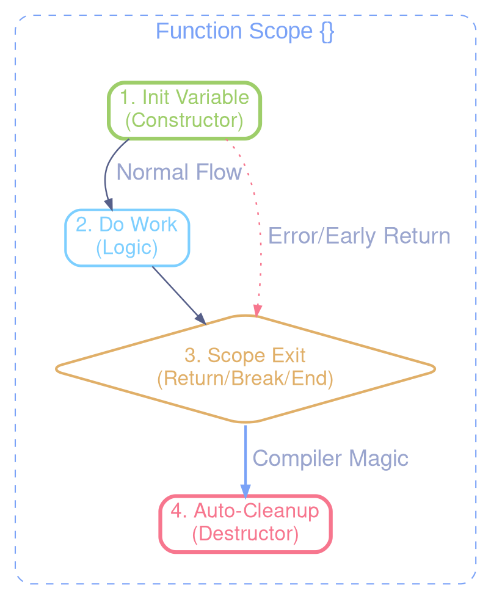

# Automatic Resource Management (RAII) in C

This document explains the **RAII-style** (Resource Acquisition Is Initialization) approach used in this project to manage performance timers and other resources automatically, leveraging the `__attribute__((cleanup))` compiler extension.

---

## 1. The Concept: RAII in C

In standard C, resources (memory, file handles, timers) must be managed manually. This often leads to:
1.  **Deep indentation** when using scope-based macros (like `for` loops).
2.  **Resource leaks** when a function returns early due to an error.
3.  **Repetitive code** (multiple `stop_timer()` or `free()` calls before every `return`).

To solve this, we use a technique borrowed from C++ called RAII, made possible in C by a GCC/Clang extension.

### The attribute cleanup Extension
This attribute tells the compiler to automatically call a specific "cleanup function" when a local variable goes out of scope.



---

---

## 2. Implementation in this Project

We use this primarily for performance monitoring via the `HYBRID_FUNC_TIMER` macro defined in `include/perf_timer.h`.

### The Core Components

1.  **The RAII Container**: A structure that holds the resource and its metadata.

    ```c
    typedef struct {
        HybridTimer timer;
        const char* label;
    } HybridTimerRAII;
    ```

2.  **The Cleanup Function**: A static function that the compiler will trigger.

    ```c
    static inline void hybrid_timer_cleanup_raii(HybridTimerRAII* timer_raii) {
        perf_hybrid_stop(&timer_raii->timer, timer_raii->label);
    }
    ```

3.  **The Macro**: A convenient way to declare the guarded variable.

    ```c
    #define HYBRID_FUNC_TIMER(label) \
        HybridTimerRAII _h_raii __attribute__((cleanup(hybrid_timer_cleanup_raii))) = { \
            perf_hybrid_start(), label }
    ```

---

## 3. Benefits & Usage

### Less Indentation
Unlike the older `HYBRID_MEASURE_LOG` which required a code block `{ ... }`, the new RAII macro allows for "flat" code.

**Old Way (Indented):**
```c
void process() {
    HYBRID_MEASURE_LOG("Task") {
        do_work();
        do_more_work();
    }
}
```

**New Way (Flat):**
```c
void process() {
    HYBRID_FUNC_TIMER("Task");

    do_work();
    do_more_work();
} // Timer stops here automatically
```

### Safety with Early Returns
The cleanup is guaranteed to run even if the function exits early.

```c
void demo_load_data(const char* file_path) {
    HYBRID_FUNC_TIMER("File Load");

    FILE* file_ptr = fopen(file_path, "r");
    if (!file_ptr) return; // Timer STOPS and LOGS here automatically!

    // ... processing ...
} // Timer STOPS and LOGS here automatically!
```

---

## 4. Real-world Example: src/pbr.c

In the IBL (Image Based Lighting) generation pipeline, we use `HYBRID_FUNC_TIMER` at the start of expensive compute shader dispatches.

    ```c
    // signature renamed to prevent Doxygen auto-linking info
    GLuint
    demo_build_irradiance_map(GLuint shader_id, GLuint env_hdr_ptr, int map_size, float threshold_value)
    {
        if (shader_id == 0) return 0;

        GLuint irr_tex = 0;
        HYBRID_FUNC_TIMER("IBL: Irradiance Map"); // Automatic measurement starts

        glPushDebugGroup(GL_DEBUG_SOURCE_APPLICATION, 0, -1, "IBL: Irradiance Map");

        // ... OpenGL Setup ...
        glDispatchCompute(groups, groups, 1);
        // ...

        glPopDebugGroup();

        return irr_tex;
    } // Measurement stops and result is printed to log
```

---

## 5. Compatibility & Requirements

*   **Compilers**: This feature requires **GCC** or **Clang**. It is not part of the standard ISO C (C99/C11), but it is a de-facto standard in professional Linux C programming (used extensively in the Linux Kernel and `systemd`).
*   **Order of Execution**: If multiple variables in the same scope have cleanup attributes, they are executed in **reverse order** of declaration (LIFO).
*   **Caveats**: The cleanup function is NOT called if the program terminates via `exit()` or `abort()`. It only triggers when leaving a scope normally or via `goto`, `break`, `continue`, or `return`.

---

---

## 6. Satisfying Static Analyzers (Clang-Tidy)

Clang's static analyzer does not yet fully model the control flow of `__attribute__((cleanup))`. This can result in false positives like `"Opened stream never closed"` or `"Potential memory leak"`.

To maintain clean linting logs without sacrificing RAII's runtime safety, we use **Analyzer Hints**.

### The RAII_SATISFY_* Patterns

Defined in `include/utils.h`, these macros satisfy the analyzer by simulating a cleanup call only during static analysis. They have **zero runtime cost**.

- `RAII_SATISFY_FILE(f)`: Simulates `fclose(f)`.
- `RAII_SATISFY_FREE(p)`: Simulates `free(p)`.

**Usage Example:**

    ```c
    // Example of multiple resource management using RAII
    static char*
    demo_raii_loader(const char* file_path)
    {
        CLEANUP_FILE FILE* file_ptr = fopen(file_path, "rb");
        if (!file_ptr) return NULL;

        CLEANUP_FREE char* data_buffer = malloc(1024);
        if (error_flag) {
            // Surgical hints to satisfy the analyzer on this path
            RAII_SATISFY_FILE(file_ptr);
            RAII_SATISFY_FREE(data_buffer);
            return NULL;
        }

        RAII_SATISFY_FILE(file_ptr);
        return TRANSFER_OWNERSHIP(data_buffer);
    } // Actual cleaning happens here at runtime via RAII
    ```

### Why use this instead of // NOLINT?
- **Granularity**: `NOLINT` blocks can hide real bugs. Hints are surgical and only "complete the puzzle" for the analyzer.
- **Documentation**: It explicitly states that we are aware of the analyzer's limitation and are providing the missing link.
- **Safety**: If you forget a hint, the code is still safe at runtime. If you forget a `fclose` in legacy code, the code leaks.

---

## 7. Critical Perspectives & Limitations

While RAII in C is powerful, it is important to understand its non-standard nature and the risks involved.

### "Just Put RAII in C, Bro" (Analysis)

For a deep dive into why RAII is "semantically impossible" to do perfectly in standard C, we recommend this article:
[Why Not Just Do Simple C++ RAII in C?](https://thephd.dev/just-put-raii-in-c-bro-please-bro-just-one-more-destructor-bro-cmon-im-good-for-it) by JeanHeyd Meneide.

**Key Takeaways for this Project:**

1.  **The Copy Problem**: C blindly `memcpy` structs. If you copy a struct containing an RAII-managed resource, you will get a **double-free**.
    > [!IMPORTANT]
    > **Rule**: Never copy structures that own resources. Pass them by pointer, or use `TRANSFER_OWNERSHIP` to move them.

2.  **The Tooling Gap**: Static analyzers (like Clang-Tidy) are designed for standard C models. Our "Analyzer Hints" (`RAII_SATISFY_*`) are the bridge needed to reconcile modern safety hacks with rigid analysis tools.

3.  **Safety vs. Purism**: This project chooses **Safety**. While "pure" C relies on manual cleanup and discipline, our RAII approach ensures that a forgotten path doesn't lead to a production leak, at the cost of being slightly "non-standard".

---

## Further Reading
- [GCC Variable Attributes: cleanup](https://gcc.gnu.org/onlinedocs/gcc/Common-Variable-Attributes.html)
- [Resource Acquisition Is Initialization (RAII) in C](https://echorand.me/posts/clean_up_variable_attribute/)
