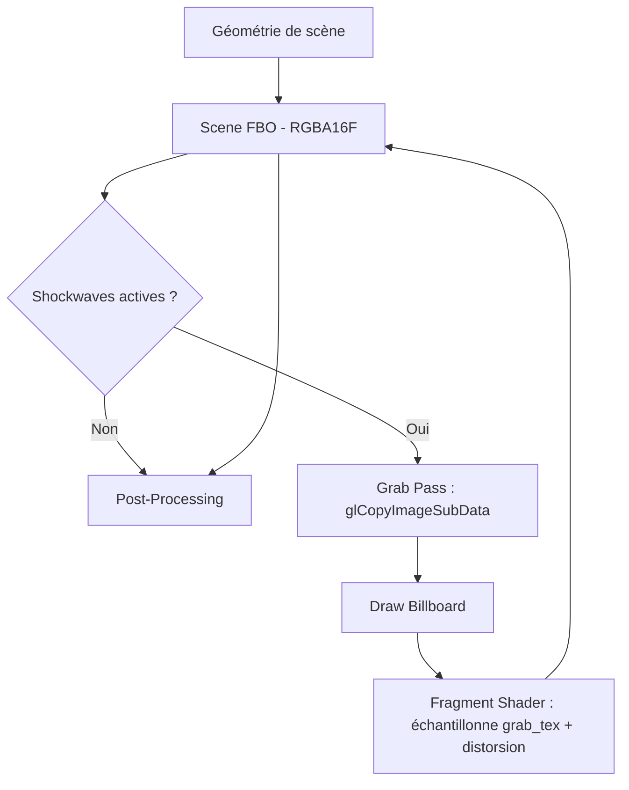

# Effet de Lensing Shockwave

## Vue d'ensemble

Lorsqu'une particule N-body franchit le rayon de confinement, une **onde de choc lensing sur billboard** s'étend depuis le point d'impact. L'effet est rendu sous forme d'un quad face-caméra qui échantillonne la scène derrière lui et applique :

1. **Déplacement UV radial** — les pixels sont repoussés vers l'extérieur depuis le centre de l'anneau
2. **Aberration chromatique** — les canaux R, G, B sont échantillonnés à des décalages différents (1.0×, 1.25×, 1.5×)
3. **Glow HDR additif** — le bord de l'anneau émet de la lumière colorée qui alimente le bloom

## Architecture



### Flux de rendu

1. La **géométrie de scène** est rendue dans le FBO HDR (`scene_color_tex`, RGBA16F)
2. **Grab pass** : `glCopyImageSubData` copie `scene_color_tex` → `grab_tex` (DMA texture-à-texture, allocation paresseuse, même format/taille)
3. **Draw billboard** : pour chaque shockwave active, un quad face-caméra est rastérisé
4. **Fragment shader** : échantillonne `grab_tex` aux UV écran décalés avec aberration chromatique par canal
5. Le **post-processing** lit le `scene_color_tex` modifié normalement

### Fichiers clés

| Fichier | Rôle |
|---------|------|
| `include/shockwave.h` | Struct `ShockwaveRenderer`, constantes, API |
| `src/shockwave.c` | Grab pass, logique emit/update/draw |
| `shaders/shockwave.vert` | Vertex shader billboard, sortie `vScreenUV` |
| `shaders/shockwave.frag` | Déplacement + aberration chromatique + glow |
| `src/scene.c` | Site d'appel avec profiler GPU + support wireframe |

## Analyse du coût du Grab Pass

Le grab pass utilise `glCopyImageSubData` (GL 4.3) — une copie **DMA texture-à-texture** qui contourne entièrement le pipeline de lecture framebuffer. Le coût est limité par la bande passante VRAM uniquement :

| Résolution | Format | Taille/frame | Bande passante @ 60 fps | % d'un GPU 200 Go/s |
|---|---|---|---|---|
| 1920×1080 | RGBA16F (8 o/px) | ~16 Mo | ~960 Mo/s | **0.5%** |
| 2560×1440 | RGBA16F | ~29 Mo | ~1.7 Go/s | **0.9%** |
| 3840×2160 | RGBA16F | ~66 Mo | ~3.9 Go/s | **2.0%** |

**Propriétés clés :**

- Aucun stall CPU, aucune synchronisation de pipeline, aucun binding framebuffer requis
- Coût = 0 quand aucune shockwave n'est active (early return avant la copie)
- Allocation paresseuse : `grab_tex` n'est créée qu'au premier usage et redimensionnée au changement de résolution
- Le handle `scene_color_tex` est câblé depuis `PostProcess` via `renderer_draw_frame`

## Analyse des optimisations du Grab Pass

Le grab pass est le coût dominant de l'effet shockwave. Quatre stratégies d'optimisation ont été évaluées avant de choisir `glCopyImageSubData` :

### Approche 1 : Grab Pass demi-résolution

Allouer `grab_tex` à `screen_w/2 × screen_h/2` au lieu de la pleine résolution. La distorsion de lensing étant un effet basse fréquence, la différence visuelle est imperceptible.

- **Gain** : ~75% de réduction de bande passante (÷4 texels copiés)
- **Complexité** : Faible — changement de taille dans `ensure_grab_texture()` + `glBlitFramebuffer` pour le downscale
- **Risque** : Aucun (le fragment shader utilise déjà des UV normalisés `[0,1]`)
- **Statut** : Reporté — optimisation future viable

### Approche 2 : `glTextureBarrier` (Éliminer la copie entièrement)

OpenGL 4.5 / `GL_NV_texture_barrier`. Lire `scene_color_tex` directement comme entrée sampler dans le même framebuffer en cours d'écriture. Un appel `glTextureBarrier()` flush les caches et rend les écritures précédentes visibles.

- **Gain** : ~100% de la bande passante de copie éliminée (~16 Mo/frame à 1080p). Coût résiduel = flush pipeline ~1-5μs vs ~0.1-0.3ms pour la copie complète
- **Complexité** : Faible — supprimer `grab_tex`, binder `scene_color_tex` directement
- **Risque** : **Comportement indéfini** si deux quads shockwave se chevauchent sur le même pixel (même texel lu ET écrit). Avec des billboards localisés c'est improbable mais pas impossible
- **Statut** : Rejeté — fragile, dépendant du driver, risque d'UB avec événements superposés

### Approche 3 : `glCopyImageSubData` (Implémentation actuelle) ✅

Copie DMA texture-à-texture directe. Ne transite pas par le pipeline de lecture framebuffer — le moteur de copie GPU gère indépendamment.

- **Gain** : ~10-30% par rapport à `glCopyTexSubImage2D` (contourne le pipeline de lecture framebuffer, aucun binding d'unité texture requis)
- **Complexité** : Triviale — remplacement drop-in, 1 ligne de changement
- **Risque** : Aucun (nécessite GL 4.3, déjà notre minimum)
- **Statut** : **Implémenté** — handle `scene_color_tex` câblé depuis `PostProcess` via `renderer_draw_frame`

### Approche 4 : Clipping AABB espace écran

Calculer la boîte englobante espace écran de tous les quads shockwave actifs, ne copier que cette zone au lieu du framebuffer entier.

- **Gain** : Variable (0-90%) — dépend de la surface écran couverte par les shockwaves. 2 shockwaves couvrant 10% de l'écran → copie 10% au lieu de 100%
- **Complexité** : Moyenne — nécessite de projeter tous les coins de billboard en espace écran et calculer min/max
- **Risque** : Aucun
- **Statut** : Reporté — bon ROI pour les scènes avec peu de petites shockwaves

### Résumé des décisions

| Approche | Gain BW | Complexité | Risque | Statut |
|---|---|---|---|---|
| Demi-résolution | ~75% | Faible | Aucun | Reporté |
| `glTextureBarrier` | ~100% | Faible | UB si overlap | Rejeté |
| **`glCopyImageSubData`** | **~10-30%** | **Triviale** | **Aucun** | **Actif** |
| Clipping AABB | 0-90% | Moyenne | Aucun | Reporté |

## Design des Shaders

### Vertex Shader (`shockwave.vert`)

Le billboard est un quad unitaire `[-1,1]` mis à l'échelle par `u_radius` et orienté face à la caméra via des vecteurs de base par produit vectoriel. Deux sorties :

- `vUV` — coordonnées locales du quad `[-1,1]` pour le profil de l'anneau
- `vScreenUV` — coordonnées écran après division perspective `[0,1]` pour échantillonner la scène

### Fragment Shader (`shockwave.frag`)

```text
Profil de l'anneau : Gaussienne centrée sur le front d'onde en expansion
                     ring_radius = 0.3 + 0.6 * progress
                     ring = exp(-8 * (dist - ring_radius)²)

Enveloppe temporelle : sin(π * progress)  →  fondu entrant/sortant lisse

Déplacement :    factor = 0.06 * intensity * ring * envelope
                 offset = factor * direction_radiale

Aberration chromatique :
                 R = sample(grab_tex, screenUV + offset * 1.0)
                 G = sample(grab_tex, screenUV + offset * 1.25)
                 B = sample(grab_tex, screenUV + offset * 1.5)

Glow additif :   couleur * 3.0 * ring * envelope * intensity * 0.25
```

### Constantes

| Constante | Valeur | Description |
|---|---|---|
| `DISTORT_STRENGTH` | 0.06 | Déplacement UV maximum au pic |
| `RING_SHARPNESS` | 8.0 | Largeur de la Gaussienne (plus = anneau plus fin) |
| `CA_SPREAD_R/G/B` | 1.0 / 1.25 / 1.5 | Multiplicateurs de déplacement par canal |
| `HDR_GLOW_SCALE` | 3.0 | Intensité du glow émissif |
| `GLOW_MIX` | 0.25 | Contribution du glow vs distorsion pure |

## Filtrage des émissions

Chaque franchissement de frontière ne produit pas forcément une shockwave visible. Trois filtres s'appliquent :

1. **Seuil de vitesse** (`SHOCKWAVE_MIN_VELOCITY = 0.05`) : seule la composante de vitesse radiale sortante est mesurée (`v_out = dot(velocity, radial_hat)`). Les franchissements tangentiels ne produisent aucun effet
2. **Suivi du pic** : par body, seule la vitesse maximale pendant une frame est enregistrée (évite les doublons du sous-stepping)
3. **Limite de capacité** (`SHOCKWAVE_MAX_ACTIVE = 16`) : quand plein, l'événement le plus ancien est évincé

## Support du temps inversé

La simulation supporte le temps inversé via `time_scale < 0`. Les shockwaves utilisent `fabsf(sim_time - start_time)` pour le calcul de l'âge, garantissant :

- L'expansion de l'anneau est toujours vers l'extérieur quelle que soit la direction du temps
- Le nettoyage supprime les événements après `SHOCKWAVE_DURATION` secondes absolues
- Aucune accumulation d'événements périmés en mode inversé

## Profilage & Observabilité

Le draw des shockwaves est instrumenté à trois niveaux :

| Outil | Mécanisme | Visibilité |
|---|---|---|
| **GPU Profiler (F3)** | `GPU_STAGE_PROFILER("Shockwave VFX")` | Overlay in-app, timer query |
| **Tracy** | `TracyCZoneN` + `tracy_gpu_zone_begin/end` | Profiler Tracy (build avec `TRACY_ENABLE`) |
| **RenderDoc** | `gl_debug_push_group("Shockwave_VFX")` | Groupes de capture RenderDoc |

Le stage du profiler inclut le grab pass et les draw calls des billboards, donnant le coût GPU total de l'effet.

## Debug Wireframe

Quand le mode wireframe est actif (touche W), les billboards shockwave sont rendus en quads filaires via `glPolygonMode(GL_FRONT_AND_BACK, GL_LINE)`. Cela montre :

- La géométrie et l'orientation du quad billboard
- Le rayon d'expansion de l'anneau au fil du temps
- Le nombre de shockwaves actives
