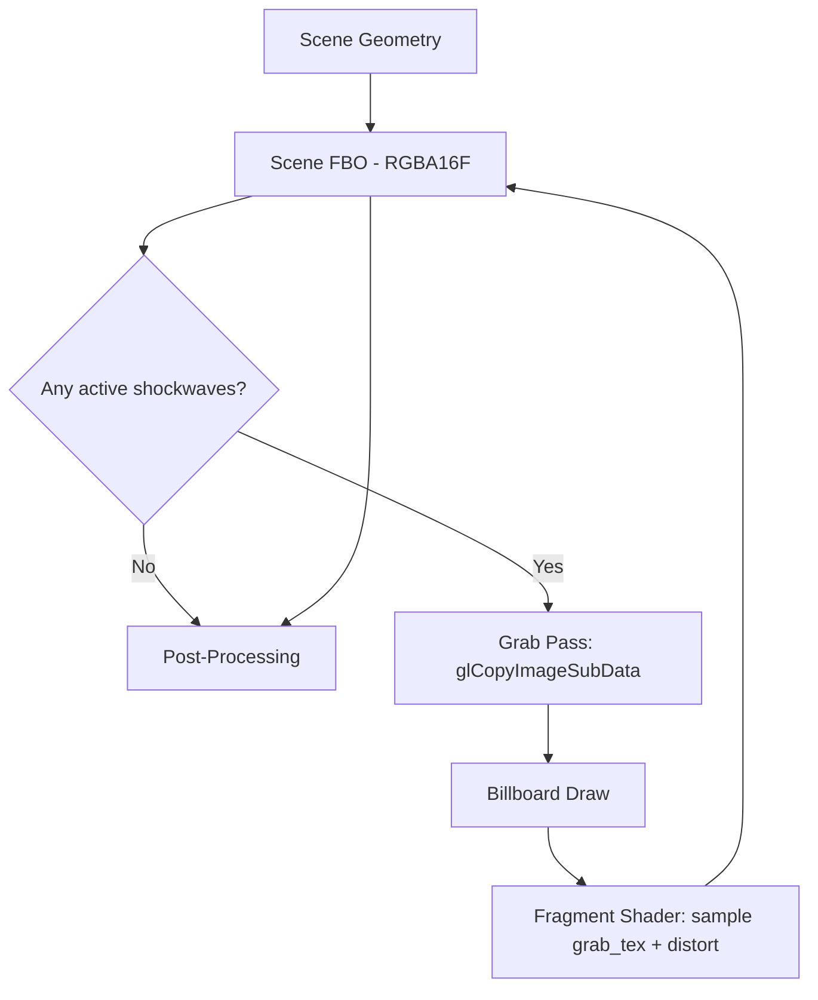

# Shockwave Lensing Effect

## Overview

When an N-body particle crosses the confinement radius, a **billboard-based lensing shockwave** expands from the impact point. The effect renders as a camera-facing quad that samples the scene behind it and applies:

1. **Radial UV displacement** — pixels are pushed outward from the ring center
2. **Chromatic aberration** — R, G, B channels are sampled at different displacement offsets (1.0×, 1.25×, 1.5×)
3. **Additive HDR glow** — ring edge emits body-colored light that drives bloom

## Architecture



### Render Flow

1. **Scene geometry** renders into the HDR FBO (`scene_color_tex`, RGBA16F)
2. **Grab pass**: `glCopyImageSubData` copies `scene_color_tex` → `grab_tex` (texture-to-texture DMA, lazy-allocated, same format/size)
3. **Billboard draw**: for each active shockwave, a camera-facing quad is rasterized
4. **Fragment shader**: samples `grab_tex` at displaced screen UVs with per-channel chromatic aberration
5. **Post-processing** reads the modified `scene_color_tex` normally

### Key Files

| File | Role |
|------|------|
| `include/shockwave.h` | `ShockwaveRenderer` struct, constants, API |
| `src/shockwave.c` | Grab pass, emit/update/draw logic |
| `shaders/shockwave.vert` | Billboard vertex shader, outputs `vScreenUV` |
| `shaders/shockwave.frag` | Displacement + chromatic aberration + glow |
| `src/scene.c` | Call site with GPU profiler + wireframe support |

## Grab Pass Cost Analysis

The grab pass uses `glCopyImageSubData` (GL 4.3) — a **texture-to-texture DMA** copy that bypasses the framebuffer read pipeline entirely. Cost is bounded by VRAM bandwidth only:

| Resolution | Format | Size/frame | Bandwidth @ 60 fps | % of 200 GB/s GPU |
|---|---|---|---|---|
| 1920×1080 | RGBA16F (8 B/px) | ~16 MB | ~960 MB/s | **0.5%** |
| 2560×1440 | RGBA16F | ~29 MB | ~1.7 GB/s | **0.9%** |
| 3840×2160 | RGBA16F | ~66 MB | ~3.9 GB/s | **2.0%** |

**Key properties:**

- No CPU stall, no pipeline synchronization, no framebuffer binding required
- Cost = 0 when no shockwaves are active (early return before the copy)
- Lazy allocation: `grab_tex` is only created on first use and resized on resolution change
- `scene_color_tex` handle is wired from `PostProcess` via `renderer_draw_frame`

## Grab Pass Optimization Analysis

The grab pass is the dominant cost of the shockwave effect. Four optimization strategies were evaluated before choosing `glCopyImageSubData`:

### Approach 1: Half-Resolution Grab Pass

Allocate `grab_tex` at `screen_w/2 × screen_h/2` instead of full resolution. Since lensing distortion is a low-frequency effect, the visual difference is imperceptible.

- **Gain**: ~75% bandwidth reduction (÷4 texels copied)
- **Complexity**: Low — only `ensure_grab_texture()` size change + `glBlitFramebuffer` for downscale
- **Risk**: None (fragment shader already uses normalized `[0,1]` UVs)
- **Status**: Deferred — viable future optimization

### Approach 2: `glTextureBarrier` (Eliminate Copy Entirely)

OpenGL 4.5 / `GL_NV_texture_barrier`. Read `scene_color_tex` directly as sampler input in the same framebuffer being written to. A `glTextureBarrier()` call flushes caches and makes prior writes visible.

- **Gain**: ~100% of the copy bandwidth eliminated (~16 MB/frame at 1080p). Residual cost = pipeline flush ~1-5μs vs ~0.1-0.3ms for the full copy
- **Complexity**: Low — remove `grab_tex`, bind `scene_color_tex` directly
- **Risk**: **Undefined behavior** if two shockwave quads overlap on the same pixel (same texel read AND written). With localized billboards this is unlikely but not impossible
- **Status**: Rejected — fragile, driver-dependent, UB risk with overlapping events

### Approach 3: `glCopyImageSubData` (Current Implementation) ✅

Direct texture-to-texture DMA copy. Does not transit through the framebuffer read pipeline — the GPU copy engine handles it independently.

- **Gain**: ~10-30% over `glCopyTexSubImage2D` (bypasses framebuffer read pipeline, no texture unit binding required)
- **Complexity**: Trivial — drop-in replacement, 1 line change
- **Risk**: None (requires GL 4.3, already our minimum)
- **Status**: **Implemented** — `scene_color_tex` handle wired from `PostProcess` via `renderer_draw_frame`

### Approach 4: Screen-Space AABB Clipping

Compute the screen-space bounding box of all active shockwave quads, copy only that region instead of the full framebuffer.

- **Gain**: Variable (0-90%) — depends on how much screen area the shockwaves cover. 2 shockwaves covering 10% of screen → copy 10% instead of 100%
- **Complexity**: Medium — requires projecting all billboard corners to screen space and computing min/max
- **Risk**: None
- **Status**: Deferred — good ROI for scenes with few, small shockwaves

### Decision Summary

| Approach | BW Gain | Complexity | Risk | Status |
|---|---|---|---|---|
| Half-res | ~75% | Low | None | Deferred |
| `glTextureBarrier` | ~100% | Low | UB if overlap | Rejected |
| **`glCopyImageSubData`** | **~10-30%** | **Trivial** | **None** | **Active** |
| AABB clipping | 0-90% | Medium | None | Deferred |

## Shader Design

### Vertex Shader (`shockwave.vert`)

The billboard is a unit quad `[-1,1]` scaled to `u_radius` and oriented to face the camera via cross-product basis vectors. Two outputs:

- `vUV` — local quad coordinates `[-1,1]` for the ring profile
- `vScreenUV` — perspective-divided screen coordinates `[0,1]` for scene sampling

### Fragment Shader (`shockwave.frag`)

```text
Ring profile:    Gaussian centered on expanding wavefront
                 ring_radius = 0.3 + 0.6 * progress
                 ring = exp(-8 * (dist - ring_radius)²)

Temporal envelope: sin(π * progress)  →  smooth fade-in/fade-out

Displacement:    factor = 0.06 * intensity * ring * envelope
                 offset = factor * radial_direction

Chromatic aberration:
                 R = sample(grab_tex, screenUV + offset * 1.0)
                 G = sample(grab_tex, screenUV + offset * 1.25)
                 B = sample(grab_tex, screenUV + offset * 1.5)

Additive glow:   color * 3.0 * ring * envelope * intensity * 0.25
```

### Constants

| Constant | Value | Description |
|---|---|---|
| `DISTORT_STRENGTH` | 0.06 | Maximum UV displacement at peak |
| `RING_SHARPNESS` | 8.0 | Gaussian width (higher = thinner ring) |
| `CA_SPREAD_R/G/B` | 1.0 / 1.25 / 1.5 | Per-channel displacement multipliers |
| `HDR_GLOW_SCALE` | 3.0 | Emissive glow intensity |
| `GLOW_MIX` | 0.25 | Glow contribution vs pure distortion |

## Emission Filtering

Not every boundary crossing produces a visible shockwave. Three filters apply:

1. **Velocity threshold** (`SHOCKWAVE_MIN_VELOCITY = 0.05`): only the outward radial velocity component is measured (`v_out = dot(velocity, radial_hat)`). Tangential crossings produce no effect
2. **Peak tracking**: per body, only the peak velocity during a frame is recorded (avoids duplicate events from sub-stepping)
3. **Capacity limit** (`SHOCKWAVE_MAX_ACTIVE = 16`): when full, the oldest event is evicted

## Time Reversal Support

The simulation supports backward time via `time_scale < 0`. Shockwaves use `fabsf(sim_time - start_time)` for age computation, ensuring:

- Ring expansion is always outward regardless of time direction
- Cleanup removes events after `SHOCKWAVE_DURATION` absolute seconds
- No accumulation of stale events in reverse mode

## Profiling & Observability

The shockwave draw is instrumented at three levels:

| Tool | Mechanism | Visibility |
|---|---|---|
| **GPU Profiler (F3)** | `GPU_STAGE_PROFILER("Shockwave VFX")` | In-app overlay, timer query |
| **Tracy** | `TracyCZoneN` + `tracy_gpu_zone_begin/end` | Tracy profiler (build with `TRACY_ENABLE`) |
| **RenderDoc** | `gl_debug_push_group("Shockwave_VFX")` | RenderDoc capture groups |

The profiler stage includes both the grab pass and the billboard draw calls, giving the total GPU cost of the effect.

## Wireframe Debug

When wireframe mode is active (W key), shockwave billboards render as line quads via `glPolygonMode(GL_FRONT_AND_BACK, GL_LINE)`. This shows:

- Billboard quad geometry and orientation
- Ring expansion radius over time
- Number of active shockwaves
