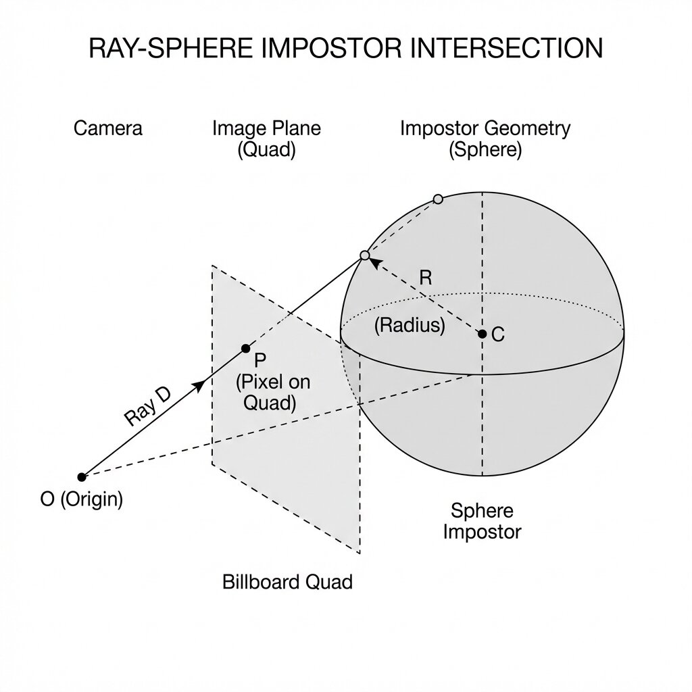
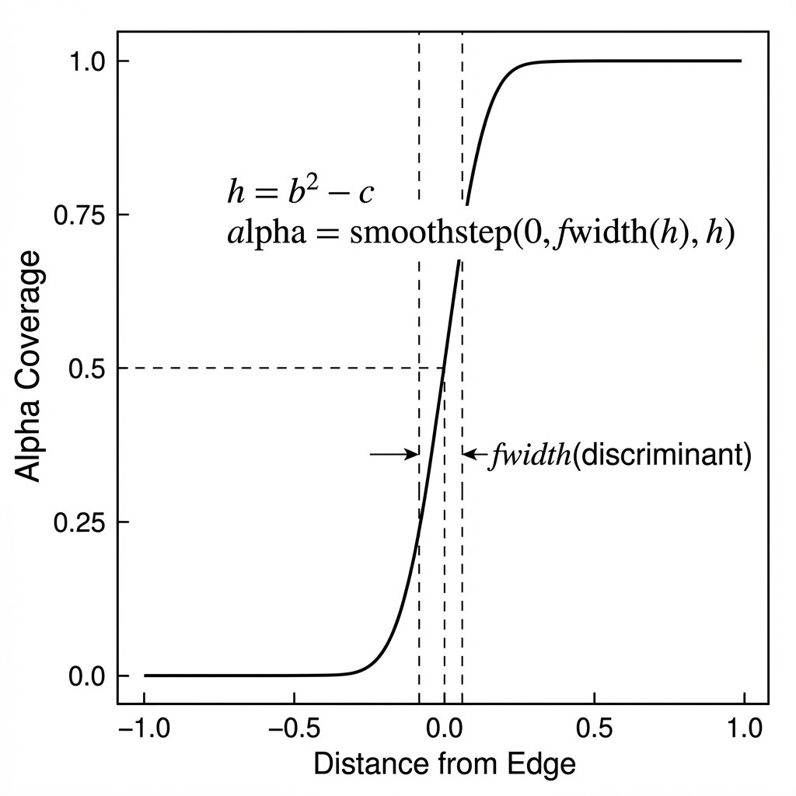

# Sphere Rendering: Transparency and Analytic Anti-Aliasing

This document details the "High Quality" rendering implementation for sphere instances (impostor billboards), including CPU sorting for correct transparency and an analytic anti-aliasing technique for perfect edges.

## 1. Sphere Sorting (Transparency)

To correctly handle Transparency Alpha Blending (`GL_SRC_ALPHA`, `GL_ONE_MINUS_SRC_ALPHA`), objects must be drawn from furthest to closest (Back-to-Front) relative to the camera.

### SphereSorter Architecture
The sorting system is encapsulated in the `sphere_sorting` module (`src/sphere_sorting.c`).

1.  **Data**:
    -   Instances (`SphereInstance`) are stored contiguously.
    -   An intermediate structure `SphereSortEntry` contains `{ index, depth }` for each sphere.
2.  **Algorithm**:
    -   Each frame, the squared distance (`glm_vec3_distance2`) between the camera and each sphere is calculated.
    -   Standard `qsort` is used to sort `SphereSortEntry` keys by descending depth (Back-to-Front).
    -   A temporary sorted instance buffer is reconstructed.
3.  **SIMD Optimization**:
    -   Instance buffers are allocated via `aligned_alloc` with 64-byte alignment (`SIMD_ALIGNMENT`) to optimize memory access and enable potential AVX vectorization.

### Rendering Pipeline
If the `USE_TRANSPARENT_BILLBOARDS` macro is enabled and "Transparent" mode is active (Key `T`):
1.  **Skybox Render** (First, depth write).
2.  **CPU Sort** of spheres via `sphere_sorter_sort`.
3.  **Upload** sorted data via `glBufferSubData`.
4.  **Draw** spheres with Blending enabled and Depth Write **disabled** (Read-Only).

### Ray-Tracing Diagram

\dot
digraph SphereLogic {
  rankdir=TD;
  bgcolor="transparent";
  pad="0.5";
  nodesep=0.5;
  ranksep=0.5;

  // Suckless-Modern "Ghost" Design Tokens (Upscaled)
  node [
    shape=rect,
    style="rounded",
    fontname="Helvetica,Arial,sans-serif",
    fontsize=16,
    fillcolor="none",
    color="#414868",
    fontcolor="#c0caf5",
    penwidth=2
  ];

  edge [
    color="#565f89",
    fontname="Helvetica,Arial,sans-serif",
    fontsize=18,
    fontcolor="#9aa5ce",
    arrowsize=0.8,
    penwidth=1.2
  ];

  subgraph cluster_fs {
    label="Fragment Shader (Per-Pixel)";
    fontname="Helvetica Bold,Arial,sans-serif";
    fontsize=18;
    fontcolor="#7aa2f7";
    style="rounded";
    color="#7aa2f7";
    margin=40;

    Ray [label="Calculate Ray\n(View space)", color="#e0af68", fontcolor="#e0af68"];
    Hit [label="Ray-Sphere Intersection", shape=diamond, color="#bb9af7", fontcolor="#bb9af7"];
    Discard [label="Discard\n(Outside)", color="#f7768e", fontcolor="#f7768e"];
    Depth [label="Write New Depth\n(Proper Z-Clipping)", color="#9ece6a", fontcolor="#9ece6a", penwidth=3];
    Normal [label="Analytic Normal\n(Perfect Edge)", color="#7dcfff", fontcolor="#7dcfff"];
  }

  Ray -> Hit;
  Hit -> Discard [label="No Hit"];
  Hit -> Normal [label="Hit Found"];
  Normal -> Depth;
}
\enddot

---

## 2. Analytic Anti-Aliasing ("Perfect AA")

The spheres are not real 3D geometry but **Impostors** (2D Billboards on a Quad). The exact sphere rendering is calculated mathematically for each pixel in the Fragment Shader (`pbr_ibl_billboard.frag`).

### The Aliasing Problem
If we brutally "cut" the pixel when the ray misses the sphere (`discard` if `discriminant < 0`), we get very visible jagged edges (aliasing). MSAA does not work well here because to the GPU, it's a flat Quad.

### Solution: Discriminant Smoothing

The Ray-Sphere intersection equation gives a **discriminant** (Delta or h).
-   h > 0: Intersection (inside sphere).
-   h < 0: No intersection (outside sphere).
-   h approx 0: Exact sphere edge.

To smooth the edge, we use the derivative of the distance function to estimate pixel coverage:
\code{.glsl}
// Analytic intersection calculation
float discriminant_val = b*b - c; // Discriminant

// If discriminant_val < 0, we are outside.
// But close to 0, we want a gradient (alpha transition).

// fwidth(discriminant_val) gives the variation across the pixel width.
// This allows normalizing to know "what fraction of a pixel" we are from the edge.
float edge_factor_val = smoothstep(0.0, fwidth(discriminant_val), discriminant_val);

// Apply this factor to alpha or final color
out_color.a *= edge_factor_val;
\endcode
This `edge_factor_val` darkens (or makes transparent) pixels that straddle the mathematical edge of the sphere, producing **analytically perfect** anti-aliasing, independent of resolution.

---

## 3. Configuration & Macros
The behavior is controlled by the `USE_TRANSPARENT_BILLBOARDS` macro defined in `include/app_settings.h` (automatically injected into shaders).

-   **"Legacy-Calculation" Mode (Macro undefined)**:
    -   Opaque Rendering (Depth Test/Write ON).
    -   No sorting.
    -   Alpha used to store Luma (FXAA optimization).
-   **"Transparent-Rendering" Mode (Macro defined + Key T)**:
    -   Transparent Rendering (Blend ON, Depth Write OFF).
    -   Back-to-Front sort every frame.
    -   Alpha used for opacity (True Transparency).
    -   FXAA recalculates Luma from RGB.
