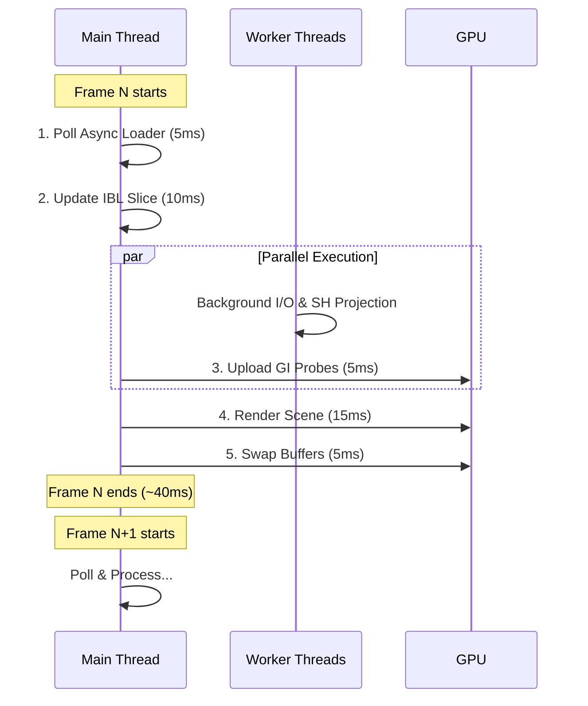

# Synchronization & Asynchrony Overview

This document provides a high-level summary of how `suckless-ogl` handles asynchronous tasks and CPU/GPU synchronization to maintain a steady, high-framerate experience.

## Core Philosophy

Modern high-performance rendering requires that the **Main Thread (Render Thread) never blocks**. Any operation that takes more than 1-2ms should be either:
1.  **Offloaded** to a background worker thread (for CPU/IO tasks).
2.  **Slicing** over multiple frames (for heavy GPU tasks).
3.  **Fenced** for non-blocking status checks (for CPU/GPU data transfers).

## Frame Scheduling & Task Interleaving

The following diagram illustrates how the various asynchronous and progressive tasks are interleaved within the main application loop to avoid frame spikes.

### 1. Asynchronous CPU Workers

We use dedicated worker threads for tasks that don't require an OpenGL context.

| Worker | Task | Sync Mechanism |
| :--- | :--- | :--- |
| **Async Loader** | I/O, Decoding, SIMD Conversion | Mutex + CondVar + PBO Handshake |
| **GI Probe Worker** | SH Projection for Indirect Light | Mutex + TryLock (Main thread never waits) |

## 2. PBO-based GPU Transfers

All pixel data movement between CPU and GPU uses **Pixel Buffer Objects (PBOs)** to enable DMA (Direct Memory Access) transfers and avoid driver-level copies.

### Uploads (Textures)
- **Double-Buffering**: Prevents the CPU from overwriting a buffer that the GPU is currently reading.
- **Unsynchronized Mapping**: `GL_MAP_UNSYNCHRONIZED_BIT` is used to bypass internal driver checks, ensuring `glMapBufferRange` returns instantly.

### Readbacks (Measurements)
- Used for: Auto-exposure (luminance), Histogram extraction, and Tracy screenshots.
- **Fence Sync**: We insert a `glFenceSync` after the GPU command.
- **Non-blocking poll**: We check the fence state using `glClientWaitSync` with a **0 timeout**. If the GPU isn't ready, we skip the update for that frame instead of blocking.

## 3. Progressive GPU Tasks (Slicing)

Some tasks cannot be offloaded to another thread because they require the primary OpenGL context. To avoid stalls, we split these tasks over multiple frames.

- **IBL Generation**: Specular and Irradiance maps are generated slice-by-slice.
- **Resource Initialization**: Texture allocation (`glTexImage2D`) and Mipmap generation are deferred into 3 steps to spread the cost.

## 4. Handling Driver Deadlocks

Special care is taken for operations that trigger synchronous driver/OS handshakes.

- **Fullscreen Toggle**: We call `glFinish()` to drain the GPU pipeline before switching modes, preventing a known deadlock on NVIDIA hardware where the mode-switch handshake stalls if the command queue is busy.
- **Deferred Resize**: Instead of recreating FBOs inside the GLFW resize callback (which can be synchronous), we set a flag and perform the resize at the start of the next frame.

## 5. Performance Monitoring

The whole system is instrumented with **Tracy fibers**. This allows you to see exactly when an async load is waiting for the main thread to map a PBO, and how much time the worker spends on converting data.

---

### Related Documentation

- [Async Loader Details](async_loader.md)
- [PBO Strategy Deep-dive](async_pbo.md)
- [Progressive IBL](progressive_ibl.md)
- [Fullscreen Deadlock Analysis](fullscreen_deadlock.md)
