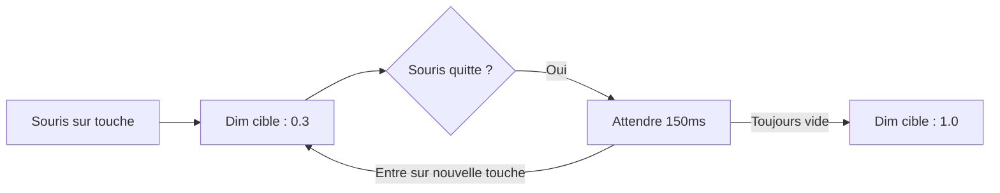

# Référence des paramètres visuels de l'interface

Ce document fournit une référence technique et visuelle pour les constantes de style et les paramètres de configuration utilisés dans le système d'interface de `suckless-ogl`, principalement situés dans `src/app_ui.c`.

## 1. Constantes globales de disposition du clavier

Ces constantes définissent le comportement et l'esthétique fondamentale de l'overlay d'aide Cyberpunk.

| Constante | Valeur | Description |
| :--- | :--- | :--- |
| `HELP_BG_COLOR` | `{0.05, 0.05, 0.07}` | Couleur bleu nuit profond pour le fond de l'overlay plein écran. |
| `HELP_BG_ALPHA` | `0.88F` | Opacité du fond. Assez élevée pour se concentrer sur l'UI, assez basse pour voir le mouvement de la scène. |
| `PANEL_FRAME_ALPHA` | `0.72F` | Opacité de la texture `kbd_panel_frame.png` (lignes de scan et bordures neon). |
| `CYBER_TITLE_COLOR` | `[Cyan neon]` | Couleur signature pour le titre "[ APPLICATION HELP ]". |

## 2. Style des touches et sélection

Ces valeurs contrôlent comment les touches individuelles réagissent aux interactions et à leur état d'assignation.

| Constante | Valeur | Description |
| :--- | :--- | :--- |
| `KEY_COLOR_DEFAULT` | `{0.15, 0.15, 0.20}` | Couleur de base pour les touches sans assignation fonctionnelle. |
| `KEY_COLOR_TOGGLE` | `[Cyan]` | Couleur d'assignation pour les fonctionnalités On/Off. |
| `KEY_COLOR_CYCLE` | `[Vert]` | Couleur d'assignation pour les fonctionnalités qui parcourent plusieurs états. |
| `KEY_COLOR_COMBINATION` | `[Orange]` | Couleur utilisée pour les touches modificatrices (Shift/Ctrl) dans une combinaison valide. |
| `KEY_DEFAULT_ALPHA` | `0.40F` | Opacité au repos pour les touches assignées. |
| `KEY_PRESSED_ALPHA` | `0.95F` | Opacité maximale atteinte quand une touche est physiquement pressée. |

## 3. Interaction et stabilisation

Paramètres logiques qui garantissent un rendu "Premium" fluide lors de l'utilisation de la souris ou du clavier.

### Stabilisation de la décroissance du survol

| Constante | Valeur | Description |
| :--- | :--- | :--- |
| `GLOBAL_DIM_MAX_FALLOFF` | `0.70F` | Degré d'assombrissement du clavier quand une touche est ciblée (1.0 - 0.7 = alpha 0.3). |
| `GLOBAL_DIM_SMOOTH_FACTOR` | `15.0F` | Vitesse de l'interpolation exponentielle (vitesse d'assombrissement). |
| `HOVER_DECAY_DURATION` | `0.15s` | **Crucial :** Période de grâce pour éviter le scintillement quand la souris passe sur les espaces. |
| `BLOOM_MAX_INTENSITY` | `0.50F` | Plafonne l'intensité du glow additif pour éviter la saturation ou le "burn-in" visuel. |

## 4. Environnement et overlays de debug

| Constante | Valeur | Description |
| :--- | :--- | :--- |
| `HISTO_BAR_COLOR_BLUE` | `[Bleu]` | Couleur pour les données d'histogramme primaires/moyennées. |
| `HISTO_BAR_COLOR_GREEN` | `[Vert]` | Couleur pour les données d'histogramme normalisées/cibles. |
| `DEBUG_TEXT_Y_OFFSET` | `Font × 4` | Espacement relatif pour les lignes de texte de debug afin d'éviter le chevauchement avec les bords de fenêtre. |
| `GRAPH_TEXT_PADDING` | `20.0F` | Rembourrage intérieur pour les boîtes d'exposition et d'histogramme. |

## 5. Chargement et animations

| Constante | Valeur | Description |
| :--- | :--- | :--- |
| `UI_SPINNER_SPEED` | `10.0` | Vitesse de rotation du spinner de chargement bleu (radians/seconde). |
| `UI_SPINNER_COLOR` | `[Bleu cobalt]` | Couleur des segments en rotation. |
| `UI_CENTER_FACTOR` | `0.5F` | Multiplicateur de coordonnées générique pour l'alignement centré. |

---

*Note : La plupart de ces constantes sont `static const` dans `src/app_ui.c` pour maintenir l'encapsulation, tandis que les tailles de disposition de base (padding, taille des touches) se trouvent dans `include/app_settings.h` pour une accessibilité externe.*
