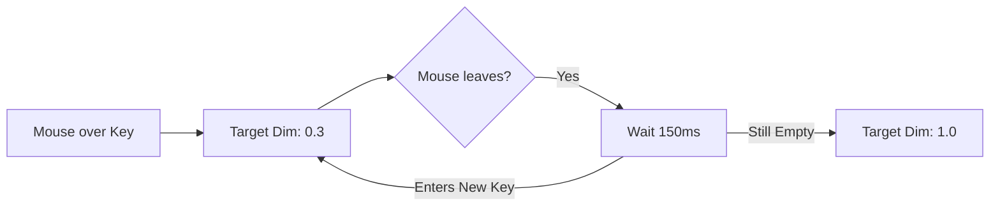

# UI Visual Parameters Reference

This document provides a technical and visual reference for the styling constants and configuration parameters used in the `suckless-ogl` UI system, primarily located in `src/app_ui.c`.

## 1. Keyboard Layout Global Constants

These constants define the behavior and core aesthetics of the Cyberpunk help overlay.

| Constant | Value | Description |
| :--- | :--- | :--- |
| `HELP_BG_COLOR` | `{0.05, 0.05, 0.07}` | Deep midnight-blue color for the fullscreen overlay backdrop. |
| `HELP_BG_ALPHA` | `0.88F` | Opacity of the backdrop. High enough to focus on UI, low enough to see scene motion. |
| `PANEL_FRAME_ALPHA` | `0.72F` | Opacity of the `kbd_panel_frame.png` texture (scanlines and neon borders). |
| `CYBER_TITLE_COLOR` | `[Neon Cyan]` | The signature color for the "[ APPLICATION HELP ]" title. |

## 2. Key Styling & Selection

These values control how individual keys react to interaction and their binding state.

| Constant | Value | Description |
| :--- | :--- | :--- |
| `KEY_COLOR_DEFAULT` | `{0.15, 0.15, 0.20}` | Base color for keys without any functional binding. |
| `KEY_COLOR_TOGGLE` | `[Cyan]` | Binding color for On/Off features. |
| `KEY_COLOR_CYCLE` | `[Green]` | Binding color for features that cycle through multiple states. |
| `KEY_COLOR_COMBINATION` | `[Orange]` | Color used for modifier keys (Shift/Ctrl) when part of a valid combo. |
| `KEY_DEFAULT_ALPHA` | `0.40F` | Idle opacity for bound keys. |
| `KEY_PRESSED_ALPHA` | `0.95F` | Maximum opacity reached when a key is physically pressed. |

## 3. Interaction & Stabilization

Logic parameters that ensure a smooth "Premium" feel during mouse or keyboard usage.

### Hover Decay Stabilization

| Constant | Value | Description |
| :--- | :--- | :--- |
| `GLOBAL_DIM_MAX_FALLOFF` | `0.70F` | How much current keyboard dims when a key is focused (1.0 - 0.7 = 0.3 alpha). |
| `GLOBAL_DIM_SMOOTH_FACTOR` | `15.0F` | Speed of the exponential interpolation (dimming speed). |
| `HOVER_DECAY_DURATION` | `0.15s` | **Crucial:** Grace period to prevent flickering when the mouse passes over gaps. |
| `BLOOM_MAX_INTENSITY` | `0.50F` | Caps the additive glow intensity to prevent visual "burn-in" or oversaturation. |

## 4. Environment & Debug Overlays

| Constant | Value | Description |
| :--- | :--- | :--- |
| `HISTO_BAR_COLOR_BLUE` | `[Blue]` | Color for the Primary/Averaged histogram data. |
| `HISTO_BAR_COLOR_GREEN` | `[Green]` | Color for the normalized/target histogram data. |
| `DEBUG_TEXT_Y_OFFSET` | `Font * 4` | Relative spacing for debug text lines to avoid overlap with window borders. |
| `GRAPH_TEXT_PADDING` | `20.0F` | Interior padding for the exposure and histogram boxes. |

## 5. Loading & Animations

| Constant | Value | Description |
| :--- | :--- | :--- |
| `UI_SPINNER_SPEED` | `10.0` | Rotation speed for the blue loading spinner (radians/sec). |
| `UI_SPINNER_COLOR` | `[Cobalt Blue]` | Color of the spinning segments. |
| `UI_CENTER_FACTOR` | `0.5F` | Generic coordinate multiplier to achieve center-alignment. |

---

*Note: Most of these constants are `static const` in `src/app_ui.c` to maintain encapsulation, while base layout sizes (Padding, Key Size) are in `include/app_settings.h` for external accessibility.*
